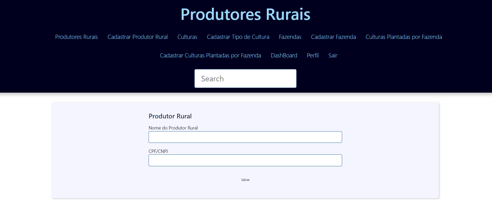

# Sistema de Cadastro de Produtor Rural

Sistema feito em PYTHON com DJANGO que consiste em um cadastro de produtor rural com os seguintes dados:

1 - Nome do produtor

2 - Nome da Fazenda

3 - Cidade

4 - Estado

5 - Área total em hectares da fazenda

6 - Área agricultável em hectares

7 - Área de vegetação em hectares

8 - Culturas plantadas (Soja, Milho, Algodão, Café, Cana de Açucar, etc...)

## Requisitos do Negócio

- O usuário deverá ter a possibilidade de cadastrar, editar, e excluir produtores rurais.
- O sistema deverá validar CPF e CNPJ digitados incorretamente.
- A soma de área agrícultável e vegetação, não deverá ser maior que a área total da fazenda
- Cada produtor pode plantar mais de uma cultura em sua Fazenda.
- A plataforma deverá ter um Dashboard que exiba:
    * Total de fazendas em quantidade
    * Total de fazendas em hectares (área total)
    * Gráfico de pizza por estado.
    * Gráfico de pizza por cultura.
    * Gráfico de pizza por uso de solo (Área agricultável e vegetação)

## Tecnologias Utilizadas

- **BANCO DE DADOS**: _PostGre_
- **BACKEND**: _PYTHON_
- **FRAMEWORK**: _DJANGO_
- **FRONTEND**: _HTML_ e _BOOTSTRAP_

## Para executar o sistema

- Baixar o fonte e salvar
- Executar via CMD ou PWS o comando **_pip install django_** para instalar o Django
- Instalar o PostGre e depois criar a base de dados **produtor_rural** (sem as tabelas, pois as mesas serão geradas pelo migration)
- Configurar o arquivo **_produtor_rural\produtor_rural\settings.py_** a variável **_DATABASES_** com os dados referentes a base de dados criada no passo anterior
- Depois executar **_python manage.py makemigrations_** para gerar as migrations (caso já tenha gerado é só passar para o próximo passo)
- Depois executar **_python manage.py migrate_** para que sejam geradas as tabelas na base de dados.
- Depois para criar o superuser para acessar o admin do Django é só executar **_python manage.py migrate_**
- Para rodar a aplicação é só executar **_python manage.py runserver_** e para entrar no admin do Djanco basta colocar **_/admin_** no final do endereço e entrar com o user e senha que foi criado no passo anterior.

## Algumas Telas do Sistema

## Observações

- O Sistema está em desenvolvimento, pois estou implementando o mesmo como um teste técnico e também para estudo, ainda se encontra na primeira versão. **(28/02/2024)**
